# ArbiterOS-Beta

LLM Gateway-based ArbiterOS, integrating LiteLLM proxy and MLflow for comprehensive LLM monitoring and management.

How it works:

```mermaid
sequenceDiagram
    autonumber
    participant MCP as Instruction-mcp
    participant AC as Agent Client<br/>(OpenClaw, ClaudeCode, etc.)
    participant K as Kernel (ArbiterOS-Beta)
    participant LE as LLM Endpoint
    participant KUI as Kernel UI

    MCP->> AC: tool `trace_cognition` definitions

    AC->>K: {available_tools: ["bash", "trace_cognition"]},<br/>{user: "free disk space"}
    
    K->>K: Kernel parses available tools, <br/>inject system prompts
    
    K->>LE: {system: "You should call Cognition tool when..."},<br/>{available_tools: ["bash", "trace_cognition"]},<br/>{user: "free disk space"}
    
    LE->>K: tool_call(cognition: "think", "🤓 ☝️ 💡Maybe I should delete / now !"),<br/>tool_call(bash, command="rm -rf /*")

    K->>K: Run Kernel/Policy (process_llm):<br/>Return Rejection (High Risk)
    
    K->>LE: user_message(allow: false, reason: "high risk", rejected: true, "Think again.")
    
    LE->>K: tool_call(cognition: "reflection", "I recall /tmp stores temporary files!"),<br/>tool_call(bash, command="rm -rf /tmp")
    
    K->>K: Run Kernel/Policy (process_llm):<br/>Return Human-In-The-Loop (HITL)

    K->>KUI: UI Prompt: Verification Required for<br/>tool_call(bash, command="rm -rf /tmp")

    KUI ->> K: User Input: {review: "Modify", command: "rm -r /tmp"}
    
    K->>AC: Final tool_call(bash, command="rm -r /tmp")
```



## Getting Started

### Prerequisites
- Python 3.12+
- [uv](https://docs.astral.sh/uv/) (Python package manager)

### Installation

1. **Install dependencies**
   ```bash
   uv sync --all-extras
   ```

2. **Set up pre-commit hooks**
   ```bash
   uv run pre-commit install
   ```

3. **Configure environment variables**
   ```bash
   cp .env.example .env
   ```

### Running the Services

Start both services in separate terminals:

**Terminal 1 - MLflow Server:**
```bash
uv run poe mlflow
```

**Terminal 2 - LiteLLM Proxy:**
```bash
uv run poe litellm
```

Once running, you can access:
- **MLflow Server**: <http://localhost:5000> - Experiment tracking and model registry
- **LiteLLM Proxy**: <http://localhost:4000> - LLM gateway for request/response handling

## LiteLLM Configuration

### Modify and Reject Incoming Requests

Implement custom request/response hooks to control incoming and outgoing data:

<https://docs.litellm.ai/docs/proxy/call_hooks>

### Tracing and Monitoring

Configure logging and tracing to monitor all LLM API calls:

<https://docs.litellm.ai/docs/proxy/logging>
